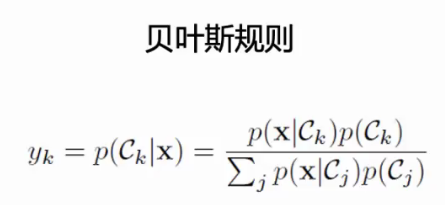

#### 传统分类器

KNN，中间空的区域原理，$K\neq 1$的情况.

贝叶斯分类器，贝叶斯规则（贝叶斯公式）

多元高斯分布，先验分布的情况？？？

#### 线性分类器

打分机制，从三种不同视角查看分类器结果（视觉视角，几何视角，）

打分函数：Hinge损失，多分类的计算结果；交叉熵损失.

损失项的选择.

#### 深度神经网络

如何描述非线性可分问题的解决思路（通过非线性变换）. 实现非线性变化的原理：激活函数（Sigmoid, tanh, ReLU）掌握梯度计算结果（用于梯度下降法）.

#### 梯度下降法（重点）

通过上游梯度计算下游梯度，掌握梯度反向传播原理. 可能考察标量和矢量计算，不会考察矩阵计算. 

流式传播可以便于求解梯度，计算速度更快.

#### 优化算法

数值梯度，解析梯度. 随机梯度下降法，动量(Momentum)的定义，AdaGrad归一化原理，掌握Adam算法原理，解释优化的道理.

二阶牛顿法难于计算不考.

#### 卷积神经网络

卷积的计算（easy），卷积核加入padding，stride后计算输出结果的大小. 池化的原理，输出结果的大小.

理解归一化原理.

神经网络架构：AlexNet，VGG，GoogleNet，Residual Networks，ResNet.

掌握**道理**，每个神经网络解决了什么问题？通过神经网络结构判别神经网络架构. 

开放性问题：根据题目条件选择网络结构.

#### 人脸识别

Adaboost，特征，积分图像，级联处理原理（问答题）

#### 语义分割

没啥想考的，理解对网络的要求

#### 目标检测

非深度学习：

深度学习：R-CNN，每个版本解决了什么问题（要非常清楚）. 细节：计算IoU，NMS，AP，mAP原理.

#### Transformer

比较新，前沿知识，知道原理，问答题借鉴它的思路.