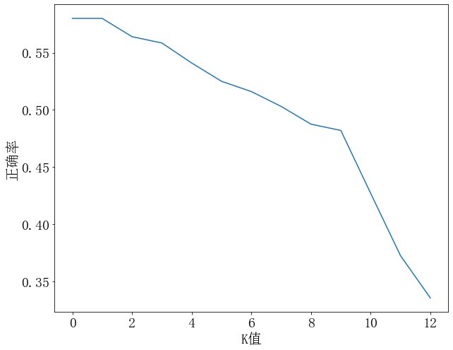
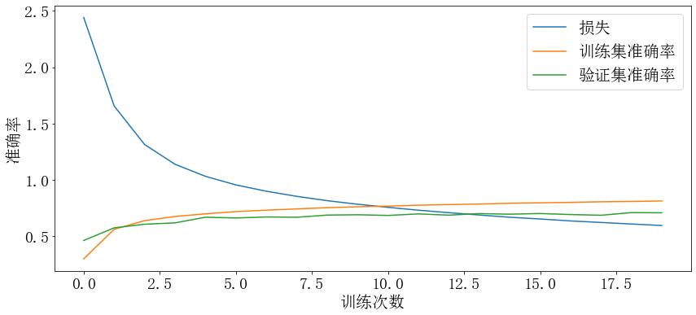

## 实验目标

使用数据集，网址：http://www.cs.cmu.edu/afs/cs/project/theo-11/www/naive-bayes.html

包含两个文本数据集：

1. 总数据集'20_newsgroups'：包含20种不同的新闻类别，总计共有19997篇文档，每种类别下应该平均有1000份新闻文档.
2. 子类文档'mini_newsgroups'：由第一个总数据集中每种类别的新闻中随机选择100份，总计2000份文档，用于验证算法的准确度.

使用第一个数据集对模型进行训练，用第二个数据集计算模型的准确率.

## 实验环境

```
Python		'3.9.12'
numpy		'1.20.0'
matplotlib	'3.5.1'
nltk		'3.7'
tensorflow	'2.6.0'
```

编辑器为Jupyter notebook. 全部代码已上传至[GitHub](https://github.com/wty-yy/LaTex-Projects/blob/main/NLP/hw2/code/main.ipynb).

## 数据预处理

### 文件读入处理

将20种文件类型进行编号，并查看内部的文档数目，使用Python3.6以上的路径处理包 `pathlib` 中 `Path` 类，对文件路径进行处理：

```python
def initDataset(fname, showInfo=True):
    path = Path(fname)  # 将路径转化为Path类
    folds = [f.name for f in path.iterdir() if f.is_dir()]  # 获取文件夹名称
    for id, fold in enumerate(folds):  # 一共有20个文件夹，分别对其内部文件进行处理
        print(f'处理第{id+1}/{len(folds)}个文件夹{fold}中...')
        now = path.joinpath(fold)
        files = [f.name for f in now.iterdir() if f.is_file()]  # 获取当前文件夹内的文件名
        for file in tqdm(files):  # 获取文件文件名
            pathFile = now.joinpath(file)
            with open(pathFile, errors='replace') as f:  # 打开文件进行处理
       		#... 文档处理
```

通过观察文档内容，可以发现，文档主要是由两部分构成，第一部分为文档的相关信息，而正文与相关信息之间由一个换行符分开，所以我们通过判断第一个换行符，来提取正文部分.

```
Xref: ...
Newsgroups: ...
Path: ...
From: ...
Subject: ...
Message-ID: ...
Organization: ...
References: ...
Lines: ...

In article <C51C4r.BtG@csc.ti.com> rowlands@hc.ti.com (Jon Rowlands) writes:
... 以下都是正文
```

```python
with open(pathFile, errors='replace') as f:  # 打开文件进行处理
    s = f.readline()
    while s != "\n":  # 先找到第一个换行符，下面则是正文
        s = f.readline()
        text = f.read()
```

### 分词操作

首先将20类的文档全部读入，将数据的主要成分提取出来，然后利用NLTK库的分词功能

1. 将文章转化为小写 `words.lower()`
2. 划分 `nltk.word_tokenize(words)`
3. 标点符号去除，用正则表达式判断单词中是否包含英文，若不包含则删去
4. 去除停用词，利用 `nltk.corpus.stopwords('english')` 获得停用词词库
5. 词干提取，使用 `nltk.stem.porter.PorterStemmer(word)` 词干提取方法
6. 词性还原，使用 `nltk.stem.WordNetLemmatizer(word)` 还原词性

```python
def extractWords(words):  # 提取分词
    words = words.lower()
    words = word_tokenize(words)  # 分词
    dropWords = ["n't"]  # 这个是计算结果中出现次数第一的，但明显不重要
    words = [word for word in words if re.match(r'[A-Za-z]', word) and word not in dropWords]  # 保证单词中必须包含字母
    stops = set(stopwords.words('english'))
    words = [word for word in words if word not in stops]
    tmp = []  # 词干提取+还原词性
    for word in words:
        stem = PorterStemmer().stem(word)  # 词干提取
        pos = ['n', 'v', 'a', 'r', 's']  # 名词，动词，形容词，副词，附属形容词
        for p in pos:
            stem = WordNetLemmatizer().lemmatize(stem, pos=p)
        tmp.append(stem)  # 还原词性，附属形容词
    words = tmp
    return words
```

数据集 `20_newsgroups` 提取出的全部数据的相关信息，分别为：类别，编号，文件数，分词数目，词频出现次数最高的前5个词.

```python
           Class  Id Files  Words  Most common words
     alt.atheism:  0  1000  10950  ['write', 'say', 'one', 'god', 'would']
   comp.graphics:  1  1000  13406  ['imag', 'file', 'use', 'program', 'write']
 ms-windows.misc:  2  1000  48850  ['max', 'g', 'r', 'q', 'p']
 ibm.pc.hardware:  3  1000  10353  ['drive', 'use', 'get', 'card', 'scsi']
sys.mac.hardware:  4  1000   9354  ['use', 'mac', 'get', 'write', 'appl']
  comp.windows.x:  5  1000  20392  ['x', 'use', 'window', 'file', 'program']
    misc.forsale:  6  1000  10830  ['new', 'sale', 'offer', 'use', 'sell']
       rec.autos:  7  1000  10378  ['car', 'write', 'get', 'articl', 'would']
 rec.motorcycles:  8  1000  10207  ['write', 'bike', 'get', 'articl', 'dod']
  sport.baseball:  9  1000   9164  ['game', 'year', 'write', 'good', 'get']
rec.sport.hockey: 10  1000  11311  ['game', 'team', 'play', 'go', 'get']
       sci.crypt: 11  1000  13087  ['key', 'use', 'encrypt', 'would', 'write']
 sci.electronics: 12  1000  10480  ['use', 'one', 'would', 'write', 'get']
         sci.med: 13  1000  15271  ['use', 'one', 'write', 'get', 'articl']
       sci.space: 14  1000  13867  ['space', 'would', 'write', 'orbit', 'one']
       christian: 15   997  12616  ['god', 'christian', 'one', 'would', 'say']
   politics.guns: 16  1000  14626  ['gun', 'would', 'write', 'peopl', 'articl']
politics.mideast: 17  1000  15105  ['armenian', 'say', 'peopl', 'one', 'write']
   politics.misc: 18  1000  13727  ['would', 'write', 'peopl', 'say', 'articl']
   religion.misc: 19  1000  12390  ['write', 'say', 'one', 'god', 'would']
                     19997 146437  ['write', 'would', 'one', 'use', 'get']
```

## 分类模型

### K近邻

选择前1000个出现频率最高的单词作为词向量的基，这里列出部分词作为基：

```
write, would, one, use, get, articl, say, know, like, think, make, peopl, good, go, time, x, see, also, could, work, u, take, right, new, want, system, even, way, year, thing, come, well, find, may, give, look, need, god, problem, much, mani, tri, first, two, file, mean, max, believ, call, run, question, point, q, anyon, post, seem, program, state, window, tell, differ, r, drive, read, realli, someth, plea, includ, g, sinc, thank...
```

将文档转化为词向量，单位化到100，由于总共有1000维，如果单位化为1，每一位大小过小，产生精度问题.

```python
def word2vector(word):  # 通过文档生成词向量
    x = np.ones(N)  # 初始化全为1，正则化向量，保证没有0分量
    for t in w:
        if t in word2num:
            x[word2num[t]] += 1
    x /= x.sum() / 100
    return x
```

```python
# KNN算法
def KNN(word, K=[4]):  # word为原始文档，K可以是一个list，包含多个K值，返回不同K值的预测结果
    now = word2vector(word)  # 获得当前文档的词向量
    dist = []
    for x, y in data:
        dist.append((np.linalg.norm(now - x), y))  # 计算欧氏距离
    dist = sorted(dist, key=(lambda x: x[0]))  # 递增排序
    ret = []
    for k in K:
        tmp = dist[1:k+1]  # 获得前k个，由于原数据集包含当前数据，第0个必然是自身，所以跳过第0个
        classify = [c[1] for c in tmp]
        ret.append(collections.Counter(classify).most_common()[0][0])  # 找到出现次数最多的类别作为预测值
    return np.array(ret)
```

计算不同的K值求解正确率，取平均正确率最高的一组，此处设定了几种K的取值：

`K = [1,2,3,4,5,6,7,8,9,10, 20, 50, 100]`

```
K=1, 正确率: 58.00%
K=2, 正确率: 58.00%
K=3, 正确率: 56.40%
K=4, 正确率: 55.85%
K=5, 正确率: 54.10%
K=6, 正确率: 52.50%
K=7, 正确率: 51.60%
K=8, 正确率: 50.30%
K=9, 正确率: 48.75%
K=10, 正确率: 48.20%
K=20, 正确率: 42.70%
K=50, 正确率: 37.25%
K=100, 正确率: 33.55%
```



我们发现K越小正确率越高，但是K过小可能发生过拟合，所以最后选取了K=4

```
K为4时，平均正确率较高55.85%
第  1 组类别，正确率: 0.43
第  2 组类别，正确率: 0.55
第  3 组类别，正确率: 0.51
第  4 组类别，正确率: 0.38
第  5 组类别，正确率: 0.56
第  6 组类别，正确率: 0.44
第  7 组类别，正确率: 0.42
第  8 组类别，正确率: 0.46
第  9 组类别，正确率: 0.67
第 10 组类别，正确率: 0.57
第 11 组类别，正确率: 0.70
第 12 组类别，正确率: 0.62
第 13 组类别，正确率: 0.51
第 14 组类别，正确率: 0.57
第 15 组类别，正确率: 0.57
第 16 组类别，正确率: 0.50
第 17 组类别，正确率: 0.56
第 18 组类别，正确率: 0.72
第 19 组类别，正确率: 0.43
第 20 组类别，正确率: 0.65
```

### 前馈型神经网络

使用tensorflow神经网络框架

```python
import tensorflow as tf
import tensorflow.keras as keras
import tensorflow.keras.layers as layers
```

构造训练集，并随机打乱，设置batch大小为16，重复原始数据集5次，得到包含 $17835*5=89175$ 个元素的数据集，每次对其进行训练（原始数据集太小了，放大了5倍）

```python
train_x, train_y = [], []
test_x, test_y = [], []
tmp = [w for words in test_words for w  in words]
for i in range(20):
    for w in test_words[i]:  # 测试集
        x = word2vector(w)
        test_x.append(x)
        test_y.append(i)
    for w in words[i]:  # 训练集
        if w not in tmp:  # 训练集元素不能在测试集中出现
            x = word2vector(w)
            train_x.append(x)
            train_y.append(i)
# 转化为np.ndarray的形式
train_x = np.array(train_x)
train_y = np.array(train_y)
test_x = np.array(test_x)
test_y = np.array(test_y)
# 构建为tf.data.Dataset数据类型
train = tf.data.Dataset.from_tensor_slices((train_x, train_y))
train = train.shuffle(10000).batch(16).repeat(5)  # 对数据集进行预处理
test = tf.data.Dataset.from_tensor_slices((test_x, test_y))
```

构建神经网络模型，包含一个含有32个神经元的隐藏层，使用sigmoid作为激活函数，softmax函数作为输出层的激活函数，使用交叉熵损失函数.

```python
model = keras.Sequential([
    layers.Dense(32, activation='sigmoid', input_shape=[N,]),  # 隐藏层
    layers.Dense(20, activation='softmax')  #　输出层
])
model.compile(optimizer='adam',  # 优化器
             loss = keras.losses.SparseCategoricalCrossentropy(),  # 损失函数
             metrics=['accuracy'])  # 将准确率作为预测指标
history = model.fit(train, epochs=20, validation_data=(test_x, test_y))
```

训练20次，得到的损失和准确率如图下图所示，15次以后，验证集准确率基本稳定在70%，训练集准确率稳定在80%左右. 下图准确率最终稳定在 70.9%



神经网络日志如下：

```
Epoch 1/20
5575/5575 [==============================] - 18s 3ms/step - loss: 2.4416 - accuracy: 0.3004 - val_loss: 2.0228 - val_accuracy: 0.4635
Epoch 2/20
5575/5575 [==============================] - 19s 3ms/step - loss: 1.6565 - accuracy: 0.5624 - val_loss: 1.5213 - val_accuracy: 0.5755
Epoch 3/20
5575/5575 [==============================] - 17s 3ms/step - loss: 1.3149 - accuracy: 0.6392 - val_loss: 1.3432 - val_accuracy: 0.6075
Epoch 4/20
5575/5575 [==============================] - 19s 3ms/step - loss: 1.1396 - accuracy: 0.6762 - val_loss: 1.2247 - val_accuracy: 0.6195
Epoch 5/20
5575/5575 [==============================] - 16s 3ms/step - loss: 1.0325 - accuracy: 0.6998 - val_loss: 1.1397 - val_accuracy: 0.6695
Epoch 6/20
5575/5575 [==============================] - 16s 3ms/step - loss: 0.9565 - accuracy: 0.7197 - val_loss: 1.0940 - val_accuracy: 0.6630
Epoch 7/20
5575/5575 [==============================] - 16s 3ms/step - loss: 0.9004 - accuracy: 0.7326 - val_loss: 1.0728 - val_accuracy: 0.6720
Epoch 8/20
5575/5575 [==============================] - 21s 4ms/step - loss: 0.8550 - accuracy: 0.7433 - val_loss: 1.0415 - val_accuracy: 0.6695
Epoch 9/20
5575/5575 [==============================] - 21s 4ms/step - loss: 0.8165 - accuracy: 0.7541 - val_loss: 1.0145 - val_accuracy: 0.6885
Epoch 10/20
5575/5575 [==============================] - 25s 5ms/step - loss: 0.7849 - accuracy: 0.7625 - val_loss: 1.0055 - val_accuracy: 0.6915
Epoch 11/20
5575/5575 [==============================] - 29s 5ms/step - loss: 0.7575 - accuracy: 0.7680 - val_loss: 1.0040 - val_accuracy: 0.6855
Epoch 12/20
5575/5575 [==============================] - 27s 5ms/step - loss: 0.7320 - accuracy: 0.7765 - val_loss: 0.9934 - val_accuracy: 0.6990
Epoch 13/20
5575/5575 [==============================] - 27s 5ms/step - loss: 0.7100 - accuracy: 0.7818 - val_loss: 1.0070 - val_accuracy: 0.6880
Epoch 14/20
5575/5575 [==============================] - 29s 5ms/step - loss: 0.6894 - accuracy: 0.7867 - val_loss: 0.9691 - val_accuracy: 0.7020
Epoch 15/20
5575/5575 [==============================] - 26s 5ms/step - loss: 0.6694 - accuracy: 0.7934 - val_loss: 0.9863 - val_accuracy: 0.6965
Epoch 16/20
5575/5575 [==============================] - 25s 5ms/step - loss: 0.6540 - accuracy: 0.7975 - val_loss: 0.9796 - val_accuracy: 0.7025
Epoch 17/20
5575/5575 [==============================] - 26s 5ms/step - loss: 0.6368 - accuracy: 0.8013 - val_loss: 0.9810 - val_accuracy: 0.6935
Epoch 18/20
5575/5575 [==============================] - 25s 4ms/step - loss: 0.6231 - accuracy: 0.8067 - val_loss: 1.0227 - val_accuracy: 0.6870
Epoch 19/20
5575/5575 [==============================] - 25s 5ms/step - loss: 0.6094 - accuracy: 0.8097 - val_loss: 0.9688 - val_accuracy: 0.7105
Epoch 20/20
5575/5575 [==============================] - 24s 4ms/step - loss: 0.5964 - accuracy: 0.8138 - val_loss: 0.9776 - val_accuracy: 0.7090
```

## 总结

通过本次实验，学会了使用 `nltp` 包对文档进行分词操作，对原式文档进行预处理，使用KNN和前馈神经网络两种不同的模型对文档进行分类预测，正确率分别在55.85%和70.9%左右，效果均不是非常好，仍有待改进.
