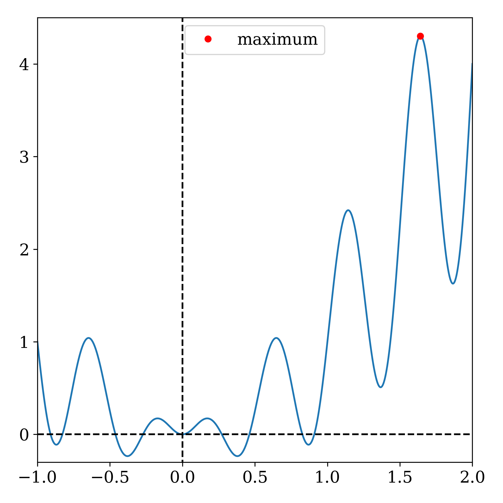
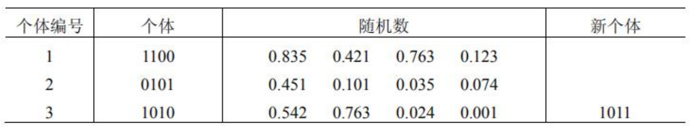
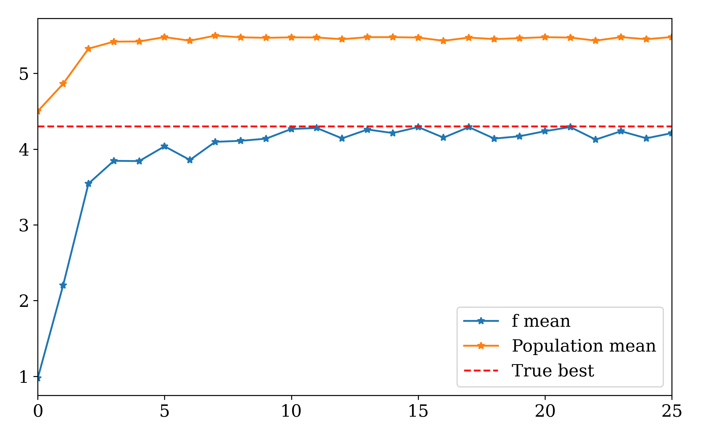
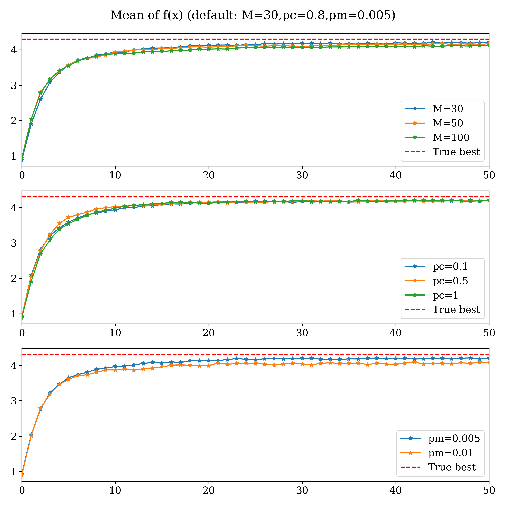

## 简单遗传算法及例题求解

简单遗传算法（Simple Genetic Algorithm, SGA）分为7个主要步骤：编码-随机产生初始个体-计算适应度函数-选择概率-交叉操作-编译操作-判断终止条件。

以最大化 $f(x) = x\sin(4\pi x)+x^2,\ x\in[-1,2]$ 为例（误差不超过 $\delta = 10^{-6}$）。



### 1. 二进制编码（染色体、个体）

假设自变量为实数，取值范围为 $[x_{\min},x_{\max}]$，编码精度为 $\delta$，编码长度为 $L$，则可通过下式求解 $L$ ：
$$
2^L - 1 = \frac{x_\max-x_\min}{\delta}
$$
理解方法：原始十进制的区间范围为 $x_\max-x_\min$，现在转化为二进制后区间长度为 $2^{L}-1$，由于二进制数只能表示一个区间中所有的**整数点**，于是将连续的实数离散化为一个个的二进制数，所以必然会有精度损失，这里 $\delta$ 就是给出了精度损失的可容忍大小，只需对原始的实数区间 $[x_\max-x_\min]$ 放大 $\delta^{-1}$ 倍，再将每个整数点一一对应到一个二进制数上就能达到目的。

> 上面例子中 $x_\min=-1,x_\max=2,\delta=10^{-6}$，于是 $L = \log_2(3\times 10^6+1)\approx 21.5\approx22$，结果向上取整。

设 $x\in[x_\min,x_\max]$，$y$ 为 $x$ 对应的二进制数，理解了十进制与二进制相互映射的原理，$x$ 与 $y$ 的关系式（解码）：
$$
\text{Decode}(y)=x = x_\min+\frac{x_\max-x_\min}{2^L-1}\text{Dec}(y)
$$
其中 $\text{Dec}(y)$ 表示二进制数 $y$ 对应的十进制数，并用 $\text{Binary}(x)$ 表示十进制数 $x$ 对应的二进制数，求解上式的反函数即可得到编码方法：
$$
\text{Encode}(x) = y = \text{Binary}\left(\left\lfloor(2^L-1)\frac{x-x_\min}{x_\max-x_\min}\right\rfloor\right)
$$
其中 $\lfloor x\rfloor$ 表示对 $x$ 向下取整。

```python
def decode(self, y):
    return self.xmin + (self.xmax - self.xmin) / ((1<<self.L) - 1) * y
# (1<<n) = 2**n 表示在二进制中将1左移n位
```

### 2. 随机产生初始群体

记初始群体中个体数目（种群规模）为 $M$（50～100），可以在 $[0,2^{L})$ 中随机采样 $M$ 得到初始群体。

```python
y = np.random.randint(0, 1<<self.L, size=self.M)  # 二进制编号后的群体y
```

### 3. 适应度函数

根据问题需要，设计关于个体的适应度函数（打分函数）$f(x)$，得分越高说明个体越能适应环境。

> 例题中适应度函数就是 $f(x) = x\sin(4\pi x)+x^2$。

```python
s = self.func(self.decode(y))  # func为适应度函数，s为群体每个个体的适应度得分
```

### 4.选择操作

根据适应度函数得到每个个体的适应值 $f_i$，由于适应度越大的个体更有可能存活下来，所以选择概率就是适应度的占比：
$$
p_i = \frac{f_i}{\sum_{i=1}^Mf_i}
$$

```python
p = (s - s.min() + 1e-8) / np.sum(s - s.min() + 1e-8)  # 每个个体的选择概率，为避免除0，所以加上1e-8
y = y[np.random.choice(self.M, self.M, p=p)]  # 选择新一代个体
```

### 5. 交叉操作

记交叉概率为 $p_c$（0.5～1），则交换个体数目为 $M_c = \lfloor M\cdot p_c\rfloor$，从选择后的群体中随机选择 $M_c/2$ 对个体 $\{(P^i_{1},P^i_{2})\}_{i=1}^{M_c/2}$（$M_c$ 为奇数则减少一个或再增加一个个体，使得最终的 $M_c$ 为偶数），对于每一对个体 $(P_1,P_2)$ 在 $[1,L)$ 中随机选择交叉位点 $q_c$，进行如下图所示的交换操作：


```python
idxs = np.random.choice(self.M, int(self.M * self.pc // 2 * 2))  # 选出交换个体的下标
for i in range(int(self.M * self.pc // 2)):
    a, b = y[idxs[i<<1]], y[idxs[i<<1|1]]  # 抽取两个个体
    qc = np.random.randint(0, self.L) + 1  # 交换前qc位
    c, d = a.copy(), b.copy()  # 先保存在c,d上
    a = ((a >> qc) << qc) + (d & ((1<<qc) - 1))  # 交换
    b = ((b >> qc) << qc) + (c & ((1<<qc) - 1))  # 交换
    y[idxs[i<<1]], y[idxs[i<<1|1]] = a, b
```

### 6. 变异操作

设变异概率为 $p_m$（0.005~0.01)，对于每个交叉后的个体，在 $[1,L]$ 上的每一位都有 $p_m$ 的概率发生变异（0和1的互换，异或操作：$0\gets1,1\gets0$），给定变异概率 $p_m$ 后，总共期望发生的变异位数为 $B = M\cdot L\cdot p_m$；

种群规模为 $M=3$，编码长度为 $L=4$，变异概率为 $p_m=0.005$ 的一次变异操作例子如下：



>  对每个个体的每一位生成一个 $[0,1)$ 之间的随机数 $r$，如果 $r \leqslant p_m$，则对该位置进行一次异或操作，例如个体编号为1,2的每一位的随机数都大于 $0.005$ ，所以不进行变异操作；而编号为3的个体的第四位随机数 $0.001 \leqslant 0.005$，所以只对第四位进行异或操作 $0\gets 1$，于是变异结果为 $1011$。

```python
for i in range(len(y)):
    for j in range(self.L):  # 枚举y[i]的第j位
        if np.random.rand() <= self.pm:  # 如果发生变异
            y[i] ^= (1<<j)  # 对第j位进行异或
```

### 7. 终止条件

执行上述步骤1,2之后，循环执行自然选择过程：3,4,5,6，直到达到终止条退出循环，终止条件常用有两种：

1. 最大迭代次数 $N$（200～500）
2. 如果已知问题最优解 $f^*$，则可设置终止条件为 $|f^{(i)}_\max-f^*|\leqslant \delta$（其中 $f^{(i)}_\max$ 表示 $1\sim i$ 次迭代中所有个体的最优适应度）

### 代码实现

```python
# -*- coding: utf-8 -*-
'''
@File    : sga.py
@Time    : 2023/04/28 11:29:27
@Author  : wty-yy
@Version : 1.0
@Blog    : https://wty-yy.space/
@Desc    : 简单遗传算法SGA在[-1,2]上最大化f(x)=x*sin(4*pi*x)+x**2，精确到6位小数
'''
import numpy as np
import matplotlib.pyplot as plt
from scipy.optimize import differential_evolution  # 比较结果误差
from pathlib import Path
PATH_FIGURES = Path(__file__).parent  # 当前代码文件夹作为图片路径

def show_scipy_min():
    g = lambda x: -1 * f(x)
    res = differential_evolution(g, bounds=[(-1, 2)], tol=1e-6)
    print(f"scipy: 最优值 f({res.x[0]:.6f}) = {-res.fun:.6f}")
    return -res.fun

class SGA:
    def __init__(self, xmin, xmax, func, delta=1e-6, M=30, pc=0.8, pm=0.005, N=200):
        self.xmin, self.xmax, self.func, self.delta = xmin, xmax, func, delta
        self.M, self.pc, self.pm, self.N = M, pc, pm, N  # 超参数
        self.best = {'f': -np.inf, 'x': 0}
        self.logs = {'p_means': [], 'f_means': []}
        # 1. 计算编码长度L
        self.L = np.ceil(np.log2((self.xmax-self.xmin) / self.delta + 1)).astype(int)

    def decode(self, y):
        return self.xmin + (self.xmax - self.xmin) / ((1<<self.L) - 1) * y
    
    def solve(self):
        # 2. 随机产生初始群体
        y = np.random.randint(0, 1<<self.L, size=self.M)
        for _ in range(self.N):
            # 3. 计算适应度值（得分）
            s = self.func(self.decode(y))
            if np.max(s) > self.best['f']:
                self.best['f'] = np.max(s)
                self.best['x'] = self.decode(y[np.argmax(s)])
            self.logs['p_means'].append(np.mean(y))
            self.logs['f_means'].append(np.mean(s))
            # 4. 每个个体的选择概率（概率分布）加上1e-8是避免除0
            p = (s - s.min() + 1e-8) / np.sum(s - s.min() + 1e-8)
            y = y[np.random.choice(self.M, self.M, p=p)]
            # 5. 交叉操作
            idxs = np.random.choice(self.M, int(self.M * self.pc // 2 * 2))
            for i in range(int(self.M * self.pc // 2)):
                a, b = y[idxs[i<<1]], y[idxs[i<<1|1]]
                qc = np.random.randint(0, self.L) + 1  # 交换前qc位
                c, d = a.copy(), b.copy()
                a = ((a >> qc) << qc) + (d & ((1<<qc) - 1))
                b = ((b >> qc) << qc) + (c & ((1<<qc) - 1))
                y[idxs[i<<1]], y[idxs[i<<1|1]] = a, b
            # 6. 变异操作
            for i in range(len(y)):
                for j in range(self.L):
                    if np.random.rand() <= self.pm:
                        y[i] ^= (1<<j)
        print(f"SGA: 最优值 f({self.best['x']:.6f}) = {self.best['f']:.6f}")
        return self.best['f']

def f(x): return x * np.sin(4 * np.pi * x) + x ** 2

if __name__ == '__main__':
    sga = SGA(-1, 2, func=f)
    sga_best = sga.solve()
    true_best = show_scipy_min()
    print(f"误差: {np.abs(sga_best - true_best)}")
    
    logs = sga.logs
    fig, ax = plt.subplots(figsize=(8, 5))
    means = np.array(logs['p_means'])
    means = (means - means.min()) / (means.max() - means.min())
    ax.plot(logs['f_means'], '-*', label='f mean')
    ax.plot(means + 4.5, '-*', label='Population mean')
    ax.plot([0, 500], [4.300863, 4.300863], '--r', label='True best')
    ax.set_xlim(0, 25)
    ax.legend()
    fig.tight_layout()
    fig.savefig(PATH_FIGURES.joinpath("plot_sga.png"), dpi=300)
    plt.show()
```

下面是一次程序的输出结果：

```
SGA: 最优值 f(1.641909) = 4.300847
scipy: 最优值 f(1.641559) = 4.300863
误差: 1.576907845990405e-05
```



我进一步对不同的超参数进行比较，得到下图：（完整代码请见[GitHub](https://github.com/wty-yy/LaTex-Projects/tree/main/Nature%20Computation/code_SGA)）

