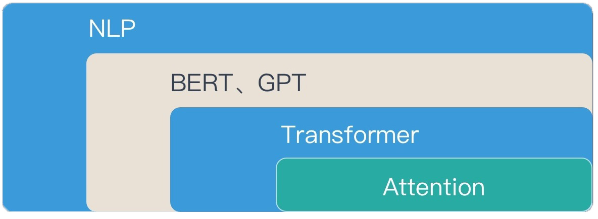
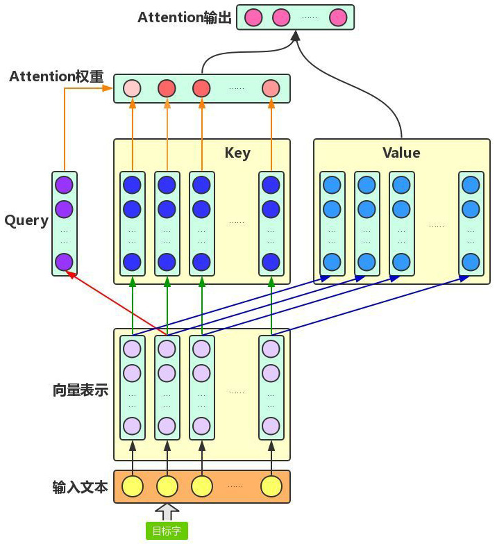
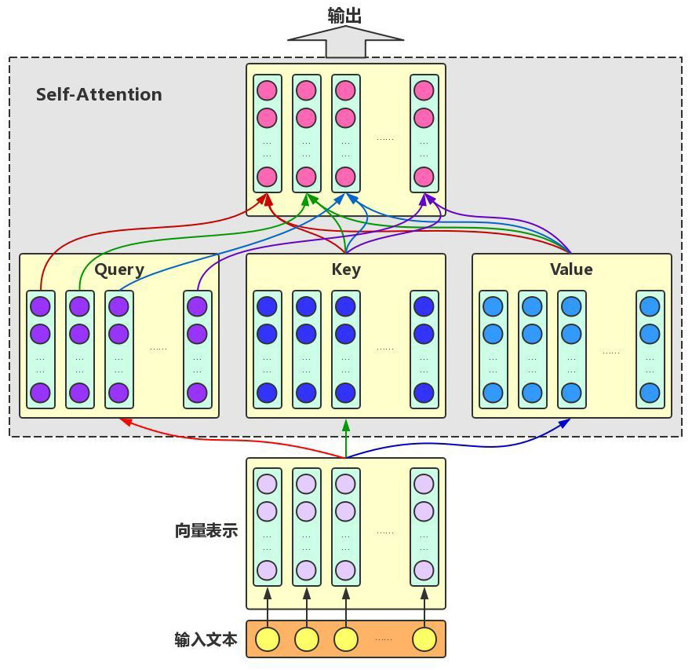
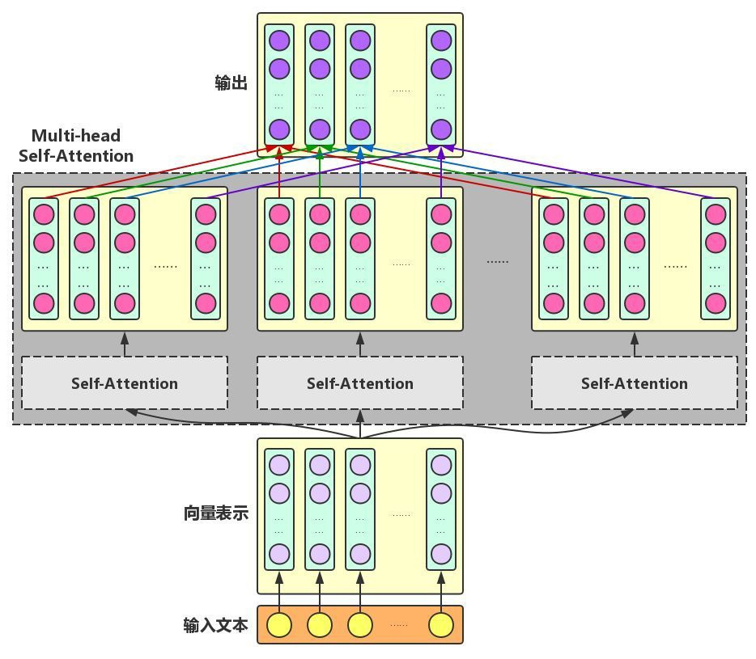
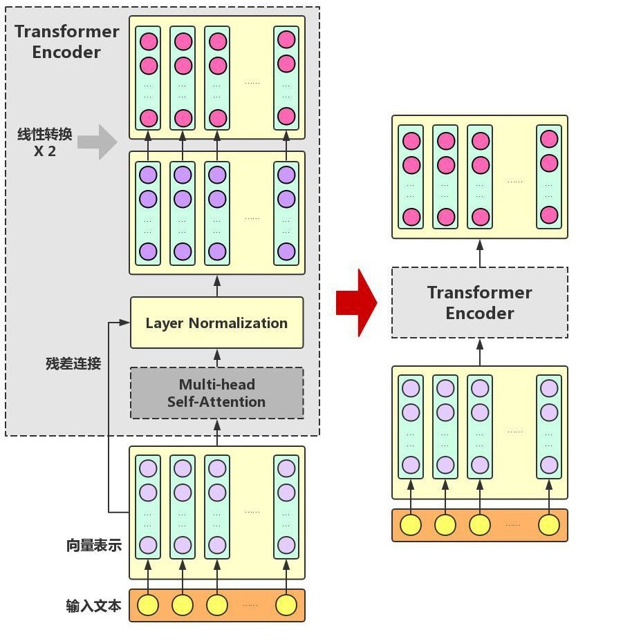
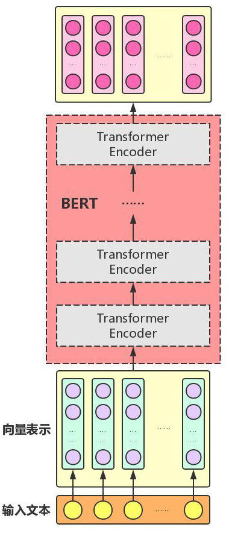
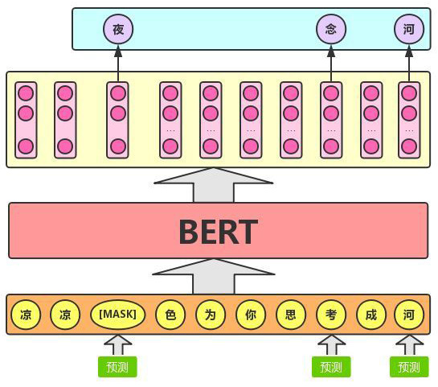

# 基于Bert的文本分类模型

## 数据集

中文数据集：

1. [yf_amazon](https://github.com/SophonPlus/ChineseNlpCorpus/blob/master/datasets/yf_amazon/intro.ipynb)，数据来源亚马逊，52 万件商品，1100 多个类目，142 万用户，720 万条评论/评分数据.
2. [weibo_senti_100k ](https://github.com/SophonPlus/ChineseNlpCorpus/blob/master/datasets/weibo_senti_100k/intro.ipynb)，数据来源新浪微博，10 万多条，带情感标注 新浪微博，正负向评论约各 5 万条.
3. [simplifyweibo_4_moods ](https://github.com/SophonPlus/ChineseNlpCorpus/blob/master/datasets/simplifyweibo_4_moods/intro.ipynb)，数据来源新浪微博，36 万多条，带情感标注 新浪微博，包含 4 种情感，其中喜悦约 20 万条，愤怒、厌恶、低落各约 5 万条（但标签给的不是很准确）
4. [waimai_10k ](https://github.com/SophonPlus/ChineseNlpCorpus/blob/master/datasets/waimai_10k/intro.ipynb)，某外卖平台收集的用户评价，正向 4000 条，负向 约 8000 条.
5. [online_shopping_10_cats ](https://github.com/SophonPlus/ChineseNlpCorpus/blob/master/datasets/online_shopping_10_cats/intro.ipynb)，10 个类别（书籍、平板、手机、水果、洗发水、热水器、蒙牛、衣服、计算机、酒店），共 6 万多条评论数据，正、负向评论各约 3 万条.

最终选择第五个数据集`online_shopping_10_cats`，根据用户评论完成以下两个分类任务：

1. 商品类别（10类）.
2. 正面还是负面评价（2类）.

```
书籍: 3851 (总体), 2100 (正例), 1751 (负例)
平板: 10000 (总体), 5000 (正例), 5000 (负例)
手机: 2323 (总体), 1165 (正例), 1158 (负例)
水果: 10000 (总体), 5000 (正例), 5000 (负例)
洗发水: 10000 (总体), 5000 (正例), 5000 (负例)
热水器: 575 (总体), 475 (正例), 100 (负例)
蒙牛: 2033 (总体), 992 (正例), 1041 (负例)
衣服: 10000 (总体), 5000 (正例), 5000 (负例)
计算机: 3992 (总体), 1996 (正例), 1996 (负例)
酒店: 10000 (总体), 5000 (正例), 5000 (负例)
```

## Bert模型

Bert模型原理参考文章：

1. [图解BERT模型：从零开始构建BERT](https://cloud.tencent.com/developer/article/1389555) 这篇文章详细的介绍了Bert的原理、transformer模型和Attention机制. （以下图片均来自该博客）
2. [什么是BERT？](https://zhuanlan.zhihu.com/p/98855346) 这两篇文章都介绍了Bert模型的输入输出还有Bert的结构，第二篇更简短一些. 其预训练部分使用的原理，MLM和NSP过程，不用很具体的讲解，只需要大致介绍他们俩分别起到什么功能.

Bert模型是一种**无监督学习的预训练模型**（能进行迁移学习的模型，用于各种NLP问题），模型主要就是将transformer模型进行堆叠而形成的，其输入与输出的维度相同，过程类似于词编码过程，将低维的词向量进行编码，并将其特征进行放大，与其他特征进行分离.（[知乎 - Embedding过程](https://zhuanlan.zhihu.com/p/164502624)）

### 模型结构

NLP，BERT，Transformer，Attention之间的关系



#### Attention机制

Attention机制主要思路就是：**通过机器学习得到单词之间的权重分布，然后作用在特征上**.

Attention机制有三种实现方式：RNN+Attention，CNN+Attention，纯Attention，第三种就是Google团队在2017发表的论文[Attention is All you need](https://arxiv.org/pdf/1706.03762.pdf)中提到的，上述模型都是使用该思路搭建的.

这里以单个文字的Attention权重计算为例，首先将该句话总每个文字使用神经网络转化为向量表示形式（词向量），取定一个文字作为当前的Query目标，将上下文的文字作为Key，并同时另存到Value值内. 然后计算Query值和Key值的相关性（利用内积进行计算），并通过softmax函数得到Attention权重（归一化），最后再对Value向量使用Attention权重加权求和，即可得到Attention机制后的输出.



我们再对该句话中每一个文字都进行如上操作即可得到整句话的Attention输出，由于只融合了该句话字之间的相关性，所以也称为Self-Attention，如下图所示：



为了进一步（增加模型的复杂性dog）提高Attention处理的多样性，处理不同语义空间下的增强向量，Transformer模型中进一步叠加Self-Attention，最后连接神经网络保持输出层和原始向量长度相同，这就得到了Multi-head Self-Attention



#### Transformer Encoder

由于Berd中只是用了Transformer的编码部分，所以只对其进行介绍. Transformer主要是在Multi-head Self-Attention的基础上加入了三个操作：

1. 残差连接（Residual Connection）：此处使用的思路应该是来自2015年ImageNet图像识别比赛第一名的[ResNet](https://arxiv.org/abs/1512.03385)，其主要用于解决深度神经网络在深度过高之后数据过度离散的问题，主要解决了过多的非线性函数导致网络难以实现恒等变换的问题，同样该操作使得网络变得更加容易训练.
2. 层标准化（Layer Normalization）：对某一层神经网络做均值为0方差为1的标准化操作，主要为了避免网络过深导致loss值过小的问题.
3. 两次线性变换：两层神经网络处理，增强模型的表达能力（保持输入与输出长度相同）.



#### Bert模型

再在Transformer模型基础上对其进行堆叠，就完成了Bert模型基本框架.（堆叠层数为12层和24层，我们将使用12层的Bert模型进行训练）



### 预训练任务

有了Bert模型之后，为了使该模型具有泛化能力，能够用于处理各种NLP问题，论文作者以Wiki作为数据集对模型进行预训练（如同在读懂文章之前，学会如何理解句式，学习语言的本身）. Bert模型主要由以下两个预训练模型构成：

1. Masked Language Model（MLM），在一句话中随机掩去该句话中的几个字，通过剩余的字去预测掩去的字是什么，类似英文中的完形填空，本质是在模仿人类学习语言的方法，这样的好处在于迫使机器去依赖上下文预测词汇，增强上下文词汇之间的关联性，并赋予其一定的纠错能力.



2. Next Sentence Prediction（NSP）：通过给出文章中的两句话，判断第一句话是否出现在第二句话之后，类似高中语文的古诗词默写和英文的段落重排，该训练可以使模型学习到整篇文章内容之间的关联性，更准确的刻画语句之间的信息.

![[Next Sentence Prediction]](./NLP大作业note.figure/Next Sentence Prediction.jpg)

### 模型应用

对于不同的现实场景Bert模型通过构建不同的输出层维度从而完成不同的分类问题，例如：单文本分类（通过在文章的开头加入[CLS]符号表示文章的语义信息），语义场景分类（使用[SEP]分隔符作为两句话之间的分隔），序列标注问题等等. 通过对Bert模型的输出进行微调从而完成各种分类问题（在输出层后加入神经网络训练）.

## 主要工作

1. 学习深度学习相关框架与技术.
2. 电商数据`online_shopping_10_cats`的预处理，均衡每种商品类别信息的数目，均衡正负评论数目.
3. 划分训练集与验证集，调整模型输出，超参数调整，提高准确率.
4. 考虑使用其他电商数据作为测试集（例如`yf_amazon`），测试模型的泛化性.

TensorFlow中的中文处理的Bert模型：[bert_zh_preprocess（预处理）](https://tfhub.dev/tensorflow/bert_zh_preprocess/3)，[bert_zh_L-12_H-768_A-12（12层的Bert模型）](https://tfhub.dev/tensorflow/bert_zh_L-12_H-768_A-12/4).

## 学习资料

#### YouTube

1. [What is Word2Vec? A Simple Explanation | Deep Learning Tutorial 41 (Tensorflow, Keras & Python)](https://www.youtube.com/watch?v=hQwFeIupNP0&list=RDCMUCh9nVJoWXmFb7sLApWGcLPQ&start_radio=1&rv=hQwFeIupNP0&t=4)

2. [Word2Vec Part 2 | Implement word2vec in gensim | | Deep Learning Tutorial 42 with Python](https://www.youtube.com/watch?v=Q2NtCcqmIww)
3. [What is BERT? | Deep Learning Tutorial 46 (Tensorflow, Keras & Python)](https://www.youtube.com/watch?v=7kLi8u2dJz0&t=799s)
4. [Text Classification Using BERT & Tensorflow | Deep Learning Tutorial 47 (Tensorflow, Keras & Python)](https://www.youtube.com/watch?v=hOCDJyZ6quA)
