## 智能感知与移动计算复习

**现状及不足**（三个爆炸和一个不足）：数据爆炸、网络爆炸、场景爆炸、算力不足；场景变换时，智能系统性能急剧下降。感（感知器技术：感官）、传（通信技术：神经）、算（计算机技术：大脑）一体化无线传感器网络。

### 无线传感器

无线网络分类：

- 有基础设施网络（固定的基站，手机上网，较贵）
- 无基础设施网络：移动Ad hoc网络，无线传感器网络（无中心化，廉价）

二者能够相互补充，适用场所不同。

传感器网络结构：

1. 组网过程：结点直接相互连接

2. 组网特点：
   - 自组织性：无中心化，两两连接；
   - 以数据为中心：不断采集数据，并把数据传出；
   - 应用相关性：不同应用场景传感器不同；
   - 动态性：可移动，传感器移动/环境变换；
   - 网络规模大：大规模部署；
   - 可靠性：通过大规模部署支持其可靠性，补充其廉价性和动态性的不稳定性，个别点失效网络仍然有效。

3. 限制与约束：
   - 电源能量：传感器的能量有限（低功耗）；
   - 通信能力：通信范围较小，因为低功耗，廉价；
   - 计算和存储能力：只能做简单计算，还是因为低功耗，廉价。

4. 感知技术（定位，测距）：
   - Hop-Count技术（DV-HOP）：基于“跳数”进行定位，每次向外传播信号，其他结点接收到信号之后继续向外传播信号，每次传播一次跳数+1，从而计算出每个结点到锚结点的跳数，从而可以反推出锚结点位置（要求结点均匀分布，区域的形状是凸形状的）；
   - 根据时间测距（GPS），根据卫星和接收端的相对时间，需要精准的时钟同步；
   - 到达时间差（TDOA），两个设备分别发出两个不同的信号，根据时间差进行测距（无需时钟同步）；
   - 到达角（AOA），测量两个设备之间的角度信息，根据信号的相位进行求解（精准）。

5. 传感器分类：
   - 能量转换型（电压式、磁电式、热电偶等）
   - 能量控制型（电感式、电容式、电阻式等；例如触摸屏）

6. 传感器一般特性（九个）：灵敏度，响应特性，线性范围，稳定性，重复性，漂移，精度，分辨率，迟滞。

7. 传感器选型原则：

   - 测量对象与环境：量程大小、被测位置、测量方式、信号的输出方法、传感器的来源。

   - 灵敏度：通常希望灵敏度越高越好，若灵敏度过高可能导致测量精度下降：
     - 测量是**单向量**，要求其他方向上灵敏度小；
     - 测量是**多维向量**，要求交叉灵敏度小；

   - 线性范围（量程）：指的是传感器输出与输入成正比的范围，线性范围越宽越好。

   - 稳定性：传感器本身和使用环境会影响其稳定性，需要较强的环境适应能力。

   - 精度：定性分析还是定量分析，若定性分析，不宜选绝对量值精度高的；若定量分析，选精度等级满足要求的。

### 感知识别

无线射频辨认（Radio Frequency IDentification, RFID）系统：目标感知与识别，分为**阅读器与标签**。

#### 阅读器分类

1. 工作频率划分：频率越高识别范围越远（与载波相关，针对不同应用设备的选取不同，课程要求：反向散射原理的标签识别技术）
   - 低频和高频：电感耦合，近距离读取，小于1 m（125 kHz, ..., 27.125 MHz）
   - 超高频和特高频：远距离读取，距离大于1 m（433 MHz, ..., 5.8 GHz）

#### 标签分类

1. 能量来源分类：
   - 无源标签：通过反射阅读器发射的载波信号来获取能量（也可实现远距离传输）；
   - 有源标签：自身电池（通讯和计算能力更强）；
   - 半无源标签：电路板上集成电池，作为辅助备用（能量综合利用）。

2. 读写能力分类：
   - 只读标签：只能读取无法修改内部内容，结构简单，成本低；
   - 读写标签：可读可写，结构复杂，成本高，安全问题。

3. 标签的组成：天线（接受能量，发射接受信号）与芯片（处理信息）

#### 能量传输过程

1. 能量转换，瓦特（W）转换为分贝（dB），分贝是相对的描述功率时需加入参考功率$P_1$，常用$P_1=1\times10^{-3}$，则分贝记为$\text{dBm} = 101g\frac{P}{1\times 10^{-3}}$。

2. 信号调制与复用，信号调制一般使用数位调变：
   - 通断键控（On-Off Keying，OOK），通电传1，断点传0
     - 问题：传输0的时候没有能量用于激活标签；
     - 改进：传1的传输的时间长一些，0的传输时间较短，通过时间的长短判断数据类型；
     - 同步问题：上下两个信号之间的时间无法知道，通过修改后的OOK，可以通过脉冲间隔进行同步。

阅读器发出，标签接受信号并返回过程成为**反向散射**，标签产生的信号成为反向散射信号。

3. 路径损耗：理想状态下，传输按照球面进行传播，随着球面的增大，单位面积能量下降，能量与距离的平方成反比，$1/4\pi r^2$，前向和反向链路能量损耗与距离的四次方成反比 $1/r^4$。使用定向天线可以提升传输距离。

4. 信号干扰：

   - 阅读器之间的干扰：相同的信号叠加在一起，可通过协商机制解决；

     解决方案：

     - 基于时分多址（传输时间不同，顺次分配时间）；
     - 基于频分多址（频率不同）；
     - 基于载波侦听多路访问（得到相应之后，独占该信号，只有自己的信号发送完，才会释放发送权限，竞争发送时间）。

   - 标签之间的干扰：无法感知到周围临近标签的存在；

     解决方案（考点）：

     - 基于ALOHA的防冲突算法；
     - 基于二叉树的防冲突算法。

##### ALOHA算法

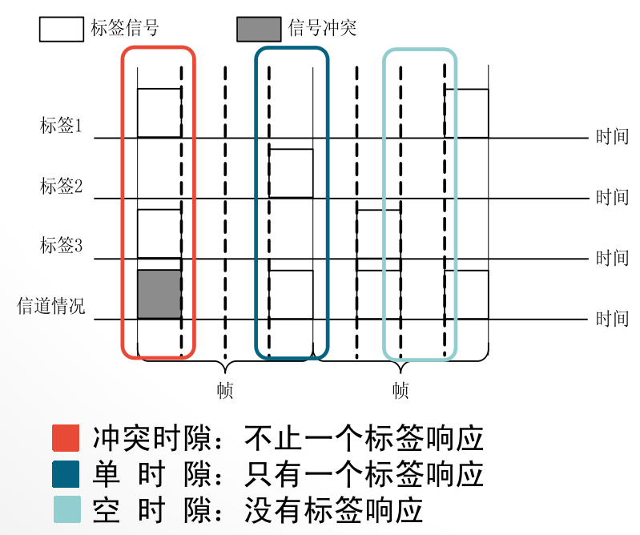

基于帧的时隙ALOHA算法，三种时隙：空时隙，单时隙（越多越好），冲突时隙；选取帧时隙的长度选取十分关键，帧的长度和当前范围内的标签数量有关，当帧长度和阅读器场内的标签数量相同时，信道利用率最高为36.8%。

优点：算法简单，标签识别性能好，结果可以进行统计分析（分析周围标签数量）；

缺点：标签“饿死”（标签发送时间相同，无法读取到标签，最坏情况时间$\infty$）。

##### 二进制树算法

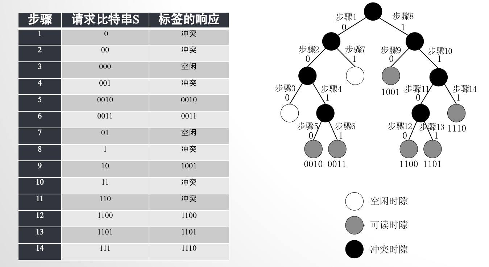

优点：算法简单，无需中间状态变量；

缺点：受到标签ID分布和长度的影响。

##### C1G2协议

七种状态图（要求会画图），标签的行为可以**用有限状态机描述**，掌握标签的状态名字、状态的位置及先后次序。

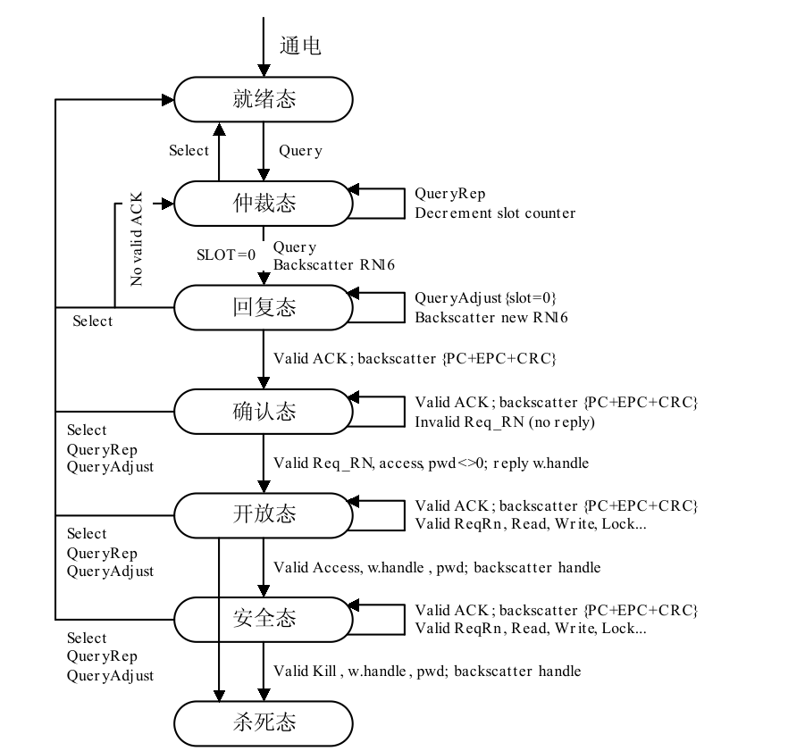

#### RFID部署

1. 硬件配置：图书馆案例分析（设计题目，考虑传感器选型，RFID的读取开销问题）
   - 书架的每个格子上安装一个阅读器天线，精确定位，但阅读器天线成本高；
   - 将阅读器天线部署在书架两侧（降低成本，精确度低）；
   - 使用单独一个可移动机器人，只需一个阅读器。

2. 标签漏读现象：实际读取范围和理论读取范围有偏差。（标签角度问题，遮挡问题）

3. 部署与读取优化：
   - 部署标签冗余方案，在箱体的三个方向上各贴一个标签。

4. 基于二进制树的防冲突算法拓展：

   SST机制（要求会画图）：

   - 非冲突节点水平右移；
   - 冲突节点向左儿子移动；
   - 空闲节点，如果是父节点的左儿子，则平移向右；否则向右上移动。

​	优点：减少空时隙数目，减少冲突时隙数目，减少延迟，减少能量消耗，不依赖假设的网络条件。

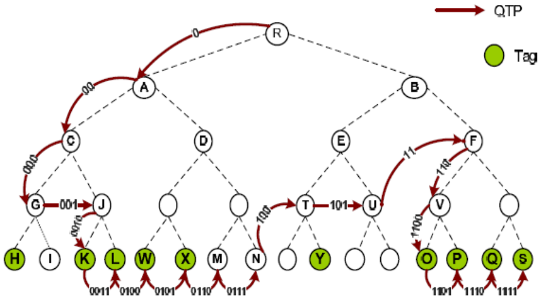

5. RFID技术特点和优势：读取距离远，速度快，主动识别，数据存储时间长；
   - 应用：物联网，液体的状态感知。

### 数据传输

#### 通信方法

1. 两种通信方式：客户服务器方式（C/S，Client/Server方式），对等方式（P2P，Peer to Peer方式）
2. 交换机：设备与交换机进行连接，三种交换方法：

   - 电路交换：先建立通路，再进行通信，最后释放通路（占用资源较大）；
   - 报文交换：存储转发机制，先发出报文，其他设备存储报文后，再转发给其他设备；
   - 分组交换：将一个报文，划分为多组，每个小分组进行转发，效率更高，无需完整的报文即可进行转发，且不同的报文能通过不同的路径进行转发。

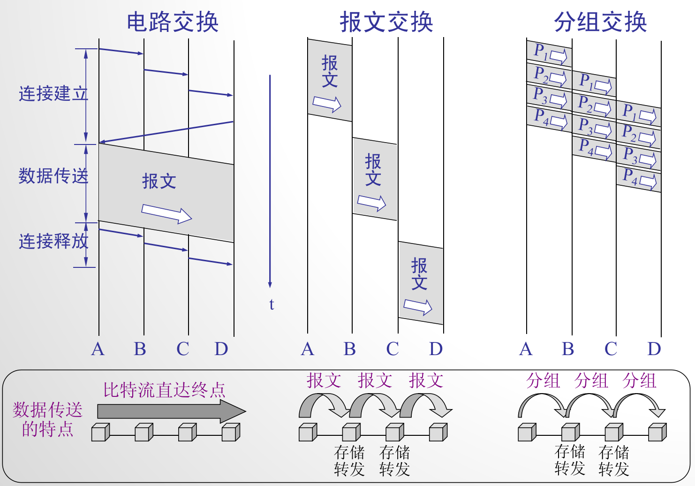

3. 五层传输协议结构（重要）：物理层（bit流），数据链路层（同步），网络层（IP层，路由），运输层（控制），应用层（显示）。
4. 信号调制方法：调制是用于解决某些信道无法传输低频分量或直流分量的方法
   - 调幅（AM）：载波振幅随信号变化而变化。
   - 调频（FM）：载波频率随信号变化而变化。
   - 调相（PM）：载波初始相位随信号变化而变化。

5. 传输要求：由于带宽限制、噪声、干扰和失真，实际信道传输的信号会产生较大的失真导致无法识别。通过以下式子可以计算极限速率与带宽、信噪比之间之间的关系：

    $$
    C = W\log_2(1+S/N)\qquad\text{单位为} b/s
    $$
    其中 $C$ 为保持信道无差错传输的极限速率， $W$ 为信道带宽(Hz)，$S$ 为信道中信号平均功率，$N$ 为信道中高斯噪声功率。

6. 信道复用技术：
   - 频分复用FDM：用户分配到频带后，通信过程中始终使用该频带。

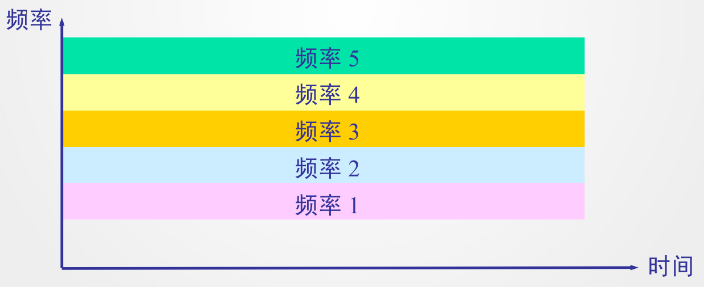

   - 时分复用TDM：将时间划分为等长的**时分复用帧**(TDM帧)，每个用户在每个TDM帧中占用固定的时隙，所有用于在不同时间占据同样的频带（用户占用的时隙以**周期性**出现，周期为TDM帧长度，TDM信号也成为等时信号）。

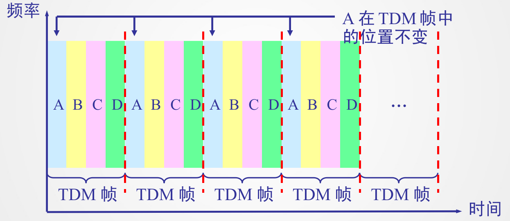

   - 码分复用CDM：通过正交的码片实现多个用户共同发送信号（考试会计算判断码片是哪个站发送的），设一个站点的长度为 $m$ 的码片序列为 $S = (-1,-1,-1,+1,+1,-1,+1,+1)$，此处 $+1$ 表示 $1$，$-1$ 表示 $0$，如果当前站点发送数据为 $1$ 时直接发送码片 $S$，如果发送数据为 $0$ 时发送码片 $S$ 的反码也就是 $-S$（按位取负）。

     对于两个站的码片 $S,T$，要求两者**正交**，即 $S\cdot T = \sum_{i=1}^mS_iT_i = 0$，并且由码片的定义可以看出 $\frac{1}{m}||S||_2^2 = \frac{1}{m}\sum_{i=1}^mS_i^2 = 1$，利用这两个性质，我们可以通过接收到的码片序列反推出每个站点发送的信息：

     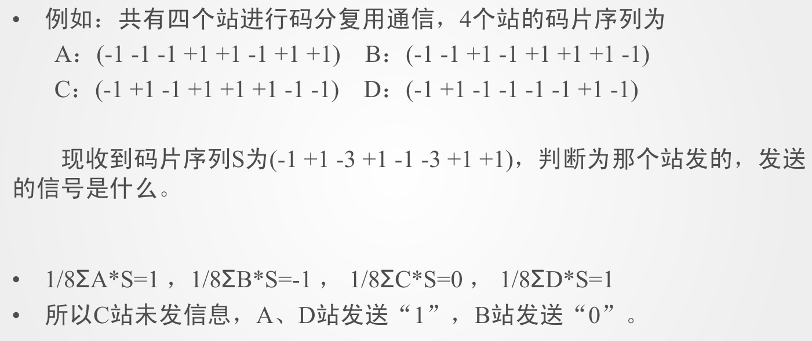

​	实现方法就是将接收到的而数据 $S$ 分别和每个站点的码分序列做内积，并归一化处理，若结果为 $1,-1$ 则表明该站点分别发送了信号1或0，若结果为 $0$ 则说明该站点未发送信号。

WIFI4和WIFI6的例子，增加每个包的大小，用户连接数量。

#### IP地址

7. IP地址（IPv4协议）：5类地址，地址长度均为32位（总共 $2^{32}-2=4294967294$ 个地址，不包括全0和全1，然而由于现在全球设备数目远大于地址数目，且主要根地址均由外国掌握，我国分配到的IP地址数目完全不够，所以后来中国倡导将地址长度扩充到64位，也就是IPv6协议），ABCDE类，根据IP首位判断是哪类地址，常用为前3个，注意到前面的网络号和后面的主机号均为 $8$ 的倍数，所以通常以8位进行分割，然后写为十进制形式：

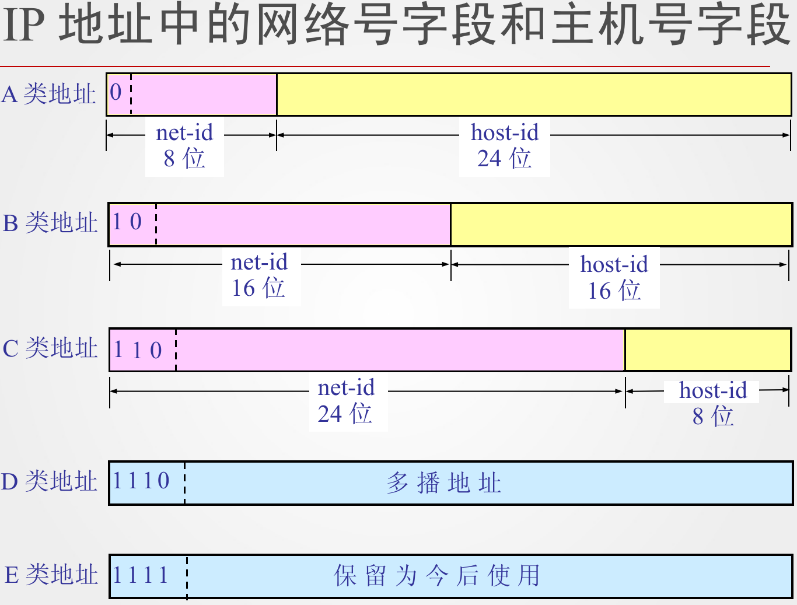

​	例如我的十进制IP地址为`111.18.34.221`对应得到的32位二进制IP地址就是`01101111.00010010.00100010.11011101`，一般我们只会给出十进制的IP地址，所以我们只要记住ABC网络分别对应十进制IP的前几位是什么就可以分辨网络类型：（可以看出我的IP地址`111.18.34.221`就是A类地址）

| 网络类型 | 最大网络数         | 第一个可用网络号 | 最后一个可用网络号 | 网络中的最大主机数 |
| -------- | ------------------ | ---------------- | ------------------ | ------------------ |
| A        | $126=2^7-2$        | `1.*.*.*`        | `126.*.*.*`        | 16777214           |
| B        | $16383=2^{14}-1$   | `128.1.*.*`      | `191.255.*.*`      | 65534              |
| C        | $2097151=2^{21}-1$ | `192.0.1.*`      | `223.255.255.*`    | 254                |

在给的IP地址下进一步划分子网，例子：IP地址为`10.10.14.23`，子网掩码为`255.255.252.0`（简记为`10.10.14.23/22` 表示IP地址为`10.10.14.23`，子网掩码的前22位都是1，后面都是0），求当前子网的IP地址范围和数目：

1. 二进制转化、计算网络地址：将IP地址和子网掩码分别转化为二进制，子网掩码二进制中末尾连续0的个数就是**主机位数**，通过将IP地址和子网掩码作二进制与运算得到子网的网络地址（起始地址）

$$
\begin{aligned}{}
\text{IP地址}\quad 10.10.14.23=&\  00001010.00001010.000011{\color{red}10.00010111}\\
\text{子网掩码}\quad 255.255.252.0=&\ 11111111.11111111.111111{\color{red}00.00000000}\\
\text{与运算，得到\textbf{网络地址}}\quad &\ 00001010.00001010.000011{\color{red}00.00000000}
\end{aligned}
$$

2. 计算广播地址：将网络地址中主机位全设置为1，得到广播地址：

$$
\begin{aligned}
\text{网络地址}\quad 00001010.00001010.000011{\color{red}00.00000000}\\
\text{广播地址}\quad 00001010.00001010.000011{\color{red}11.11111111}
\end{aligned}
$$

3. 于是子网的IP地址范围为 $[\text{网络地址}+1,\text{广播地址}-1]=[10.10.12.1,10.10.15.254]$，主机数目就是子网IP地址范围中数的个数 $2^{\text{主机位数}}-2 = 2^{32-22}-2 = 2^{10}-2=1022$。

子网划分：如果给出的IP范围中的主机数目很大，我们期望将其划分为两个小的子网，并使每个子网中的主机数目达到目标要求，一般方法就是直接对半分，通过修改IP地址和子网掩码划分原来的IP地址，一个例子：

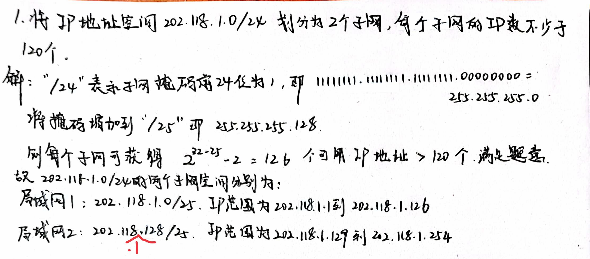

#### 校验码

##### 简单奇偶效验

码距为2，只能检测出奇数位的错误，且无法检测出错误位置。实现：若干有效信息+一个二进制位，奇校验保证整个校验码中的1的个数为奇数个（也就是如果有效信息中1是偶数个，那么奇偶校验为就是1，要使得最终的校验码中1的个数为奇数）；偶校验，反之亦然，要求校验码中1的个数为偶数个。（一般使用奇校验，因为其可以避免全是0的bit串）

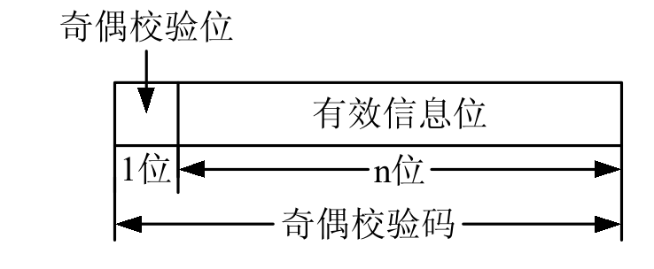

##### 交叉奇偶校验

二位版本的奇偶校验：

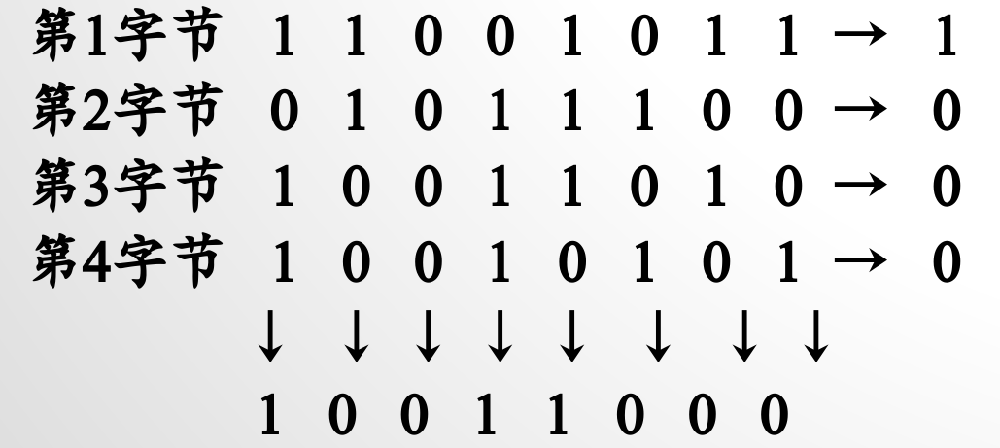

##### 海明码

将校验码分为两部分：$2^r$ 位的编码称为冗余码总共 $r$ 个（冗余位数），非冗余码部分为信息码（原始信息）。

1. 第一个冗余码A是信息码的第 $1,3,5,7,9,...$ 位的偶校验
2. 第二个冗余码B是信息码的第 $2,3,6,7,10,11,...$ 位的偶校验
3. 第三个冗余码C是信息码的第 $4,5,6,7,12,...$ 位的偶校验，等等

第 $r$ 个冗余码的位数确定可以参考下图，就是二进制数第 $r$ 位是 $1$ 对应的位置：

计算出海明码之后，复原发送端的信息码方法是：分别求出海明码中冗余码对应位置的偶校验，按码位累加，最后得到的累积和如果不是 $0$，则说明该位置的海明码错误，进行修改后得到正确的海明码，最后将 $2^k$ 位的冗余码删去，就得到发送端的信息码。（这种检验好像只能检验一个码位的错误）

##### 循环冗余检验

一个作业题例子解释该校验码：$x^3+1$ 就表示 $1001$（直接令 $x=2$ 即可）

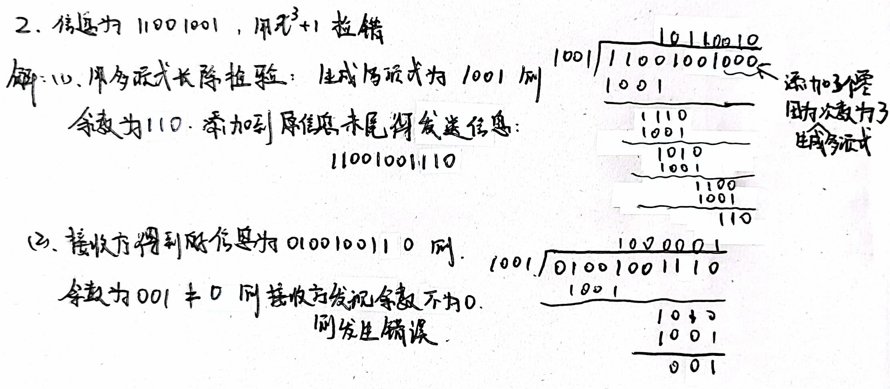

##### 格雷码

格雷码（Gray Code）：任意两个相邻的格雷码之间只有一位二进制数不同。

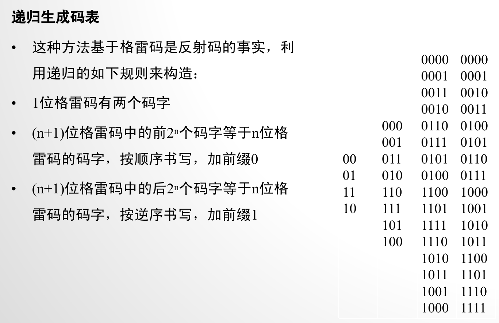

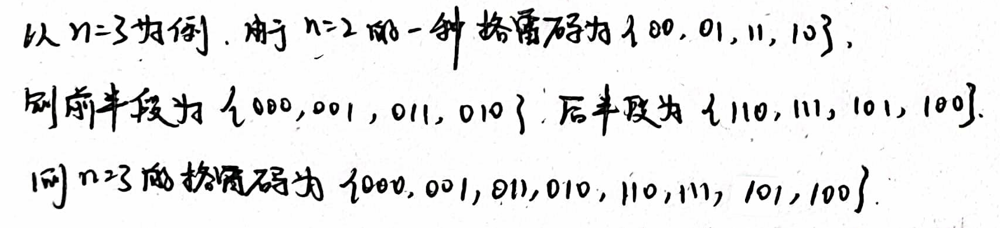

二进制数转化为格雷码：假设二进制数字B的位数为 $n$ 位，先对二进制最高位补0，然后顺次计算
$$
G_i = B_i\oplus B_{i+1}\quad (0\leqslant i\leqslant n-1)
$$
其中 $\oplus$ 表示二进制异或操作。例如，二进制码为 $1101$，则补最高位为 $01101$，然后两两位做异或操作，得到格雷码为 $1010$。